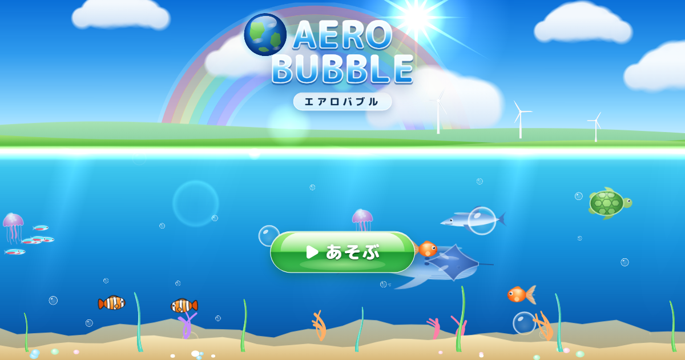
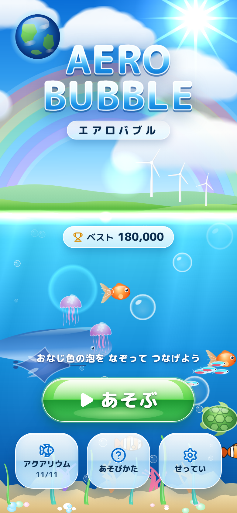
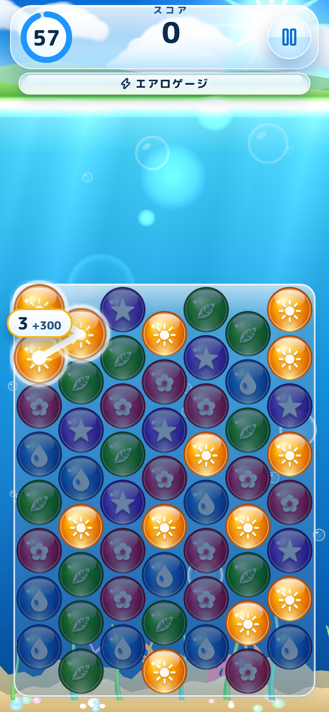
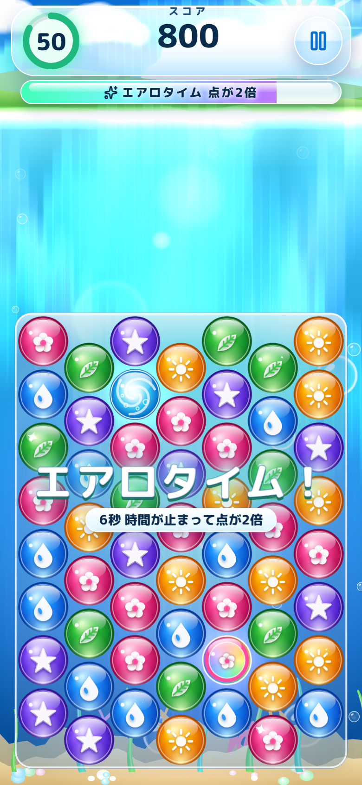
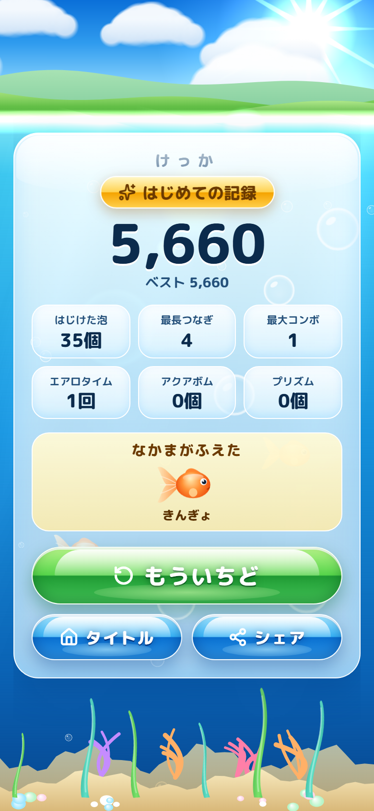

# エアロバブル（AERO BUBBLE）



同じ色のつやつやの泡を指でなぞってつなぎ、はじけさせる、スマホ向けの60秒パズルです。
テーマは **フルティガーエアロ**：晴れた空、緑の丘、光の差しこむ海、ガラスの泡、レンズの光、オーロラ。

**あそぶ：https://109mei.github.io/aero-bubble/** （スマホの縦画面がおすすめ。パソコンのブラウザでも遊べます）

## あそびかた

1. 同じ色の泡を指でなぞって、となりどうしを3つ以上つなぐ。指を離すとはじける
2. 7つ以上つなぐと **アクアボム**、11以上で **プリズム**。タップするとまとめて消せる
3. 消した泡で **エアロゲージ** がたまると **エアロタイム**：6秒間 時間が止まって点が2倍
4. 続けて消すとコンボで点が上がる
5. 60秒で最高点をめざす。遊ぶほど **アクアリウム** の仲間（11種）が増えて、海と空がにぎやかになる

泡には色ごとに印（しずく・はっぱ・たいよう・はな・ほし）があるので、色の見分けが苦手でも遊べます。

| タイトル | あそぶ | エアロタイム | 結果 |
|---|---|---|---|
|  |  |  |  |

## つくり

- Vite ＋ TypeScript ＋ PixiJS（景色と泡）＋ React（画面の部品）＋ Zustand ＋ Zod
- ルール本体（src/core）は画面を知らない Pure TypeScript。種つきの乱数で、同じ種・同じ操作なら同じ結果
- 絵はすべてコード（Canvas2D）で描き、音も WebAudio でその場で作るので、画像と音のファイルはありません
- 記録はブラウザ（localStorage）に保存。設定から書き出し・読み込みができます
- 仕様：[docs/SPEC.md](docs/SPEC.md)、企画：[docs/PLAN.md](docs/PLAN.md)

## 開発

```bash
npm install
npm run dev        # http://localhost:5176/aero-bubble/
npm test           # Vitest（ルール・決定性・セーブ・手ざわりの目安）
npm run e2e        # Playwright（390×844 のスマホ縦画面）
npm run screens    # 画面のスクリーンショットを docs/screens/ に保存
npm run sim -- all 60   # ボットで遊んでバランスを測る
npm run build      # 公開用のビルド
```

main に push すると、GitHub Actions がテスト → ビルド → GitHub Pages への公開を行います。
